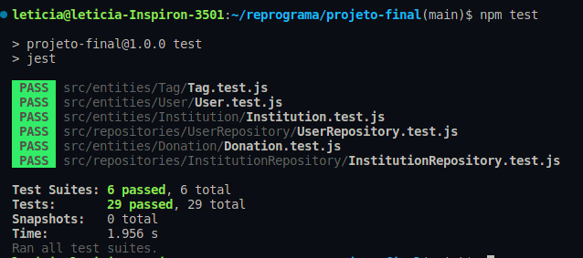

> Projeto final do curso Imersão Javascript do Reprograma.  
> Autora: Letícia Amaral de Lara.  
> Início: 09/09/2023  
> Fim: 15/09/2023

- [Informações do projeto](#informações-do-projeto)
  - [Tema e Objetivo](#tema-e-objetivo)
    - [Qual problema foi identificado?](#qual-problema-foi-identificado)
    - [Qual solução foi encontrada?](#qual-solução-foi-encontrada)
  - [Pontos iniciais](#pontos-iniciais)
  - [Tecnologias usadas](#tecnologias-usadas)
  - [Metodologias usadas](#metodologias-usadas)
- [Informações de desenvolvimento](#informações-de-desenvolvimento)
  - [Testes e Jest](#testes-e-jest)

# Informações do projeto

## Tema e objetivo

Criar um portal onde seja possível cadastrar ONG's que ajudam animais e locais onde se pode adotar, encontrar ajuda, tratamento gratuito ou onde se possa realizar doação para essa causa.

### Qual problema foi identificado?

A um tem eu tenho visto que pessoas querem ajudar animais em situação de abandono, dar algum tratamento, comida ou até mesmo um lar, mas por não condições de poder dar essa assistência nem todos ajudam, seja por não ter espaço, não ter condições financeiras ou por não conhecer locais para onde levar esses animais.

### Qual solução foi encontrada?

Ter um portal onde traga de fácil acesso informações de ONG's ou abrigos que ajudam animais, trazendo as principais informações de assistência para uma melhor pesquisa, informações de contato e localização e a possibilidade de doações para essas instituições.

## Pontos iniciais

- Cadastramento de ONG's e centros de ajuda;
- Encontrar locais cadastrados;
- Filtro de locais pelo tipo de atentimento ou serviço procurado;
- Informações de doações;

## Tecnologias usadas

- Javascript
- NodeJS
- Jest
- POO

## Metodologias usadas

- TDD: Red, Green, Refactor

# Informações de desenvolvimento

O projeto está dividido em classes segundo POO, na pastas `src/entities/` está as principais classes do Usuário, Intitutição, Doações e Tags, visando as principais entidades que podem ser usadas no sistema. Na pasta `src/repositories/` está localizadas as classes referentes as listas, ou seja, usuários e instuições no geral, usando um sistema com auxilio do banco de dados, seria onde ficaria armazenado os elementos dessas classes.

## Testes e Jest

Para gerar os testes usar:

```
npm run test
```


